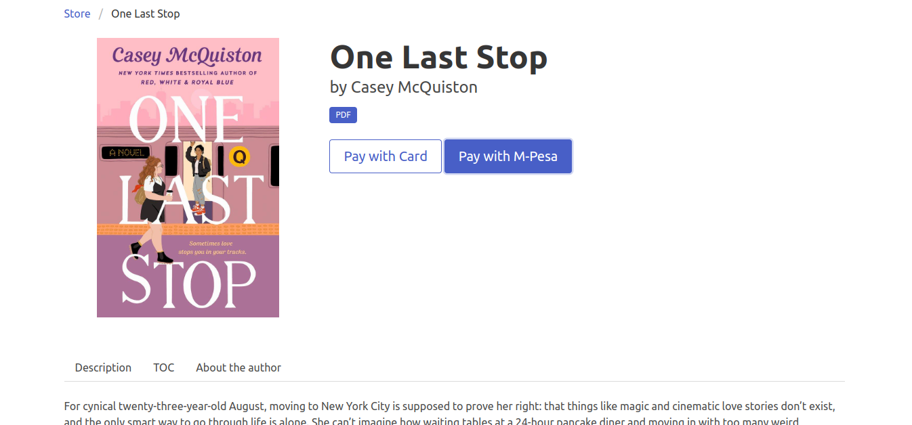
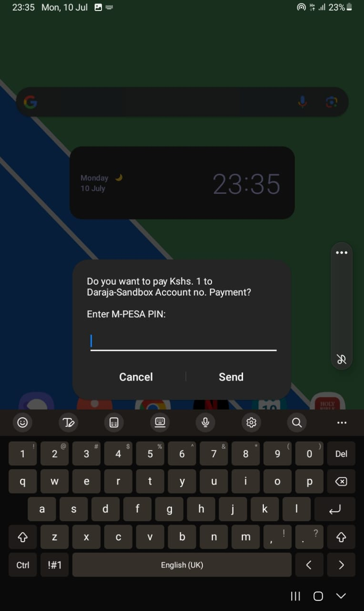
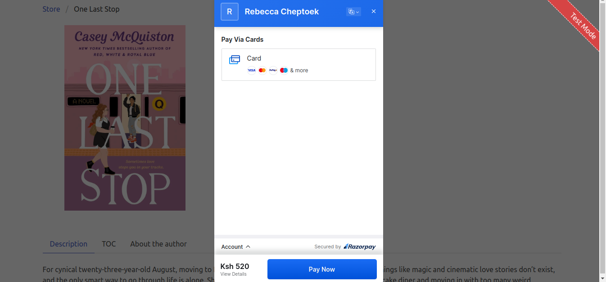
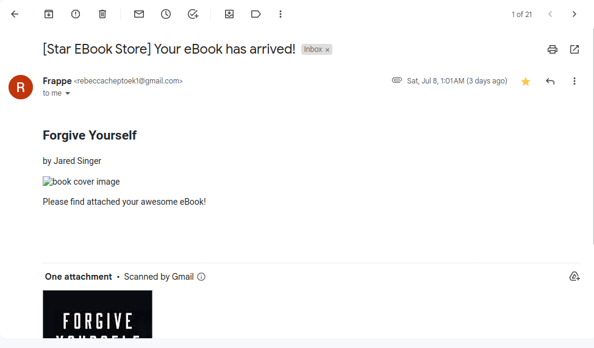

## Star Ebook Store

Star Ebook Store

## Project Description
The eBook Store is a web application that allows users to browse, purchase, and download eBooks. It provides a user-friendly interface for managing eBook collections, integrating payment gateways, and delivering digital content to customers.

## Screenshots

- eBook Collection Page: View and explore a wide range of eBooks available.

- Store Page: A simple stBrowse and search for eBooks based on authors, or titles.

- eBook Details Page: Get detailed information about a selected eBook before purchasing.

- M-Pesa Payment Prompt: Conveniently make payments using the M-Pesa payment gateway.

- Razorpay Payment Integration: Seamlessly process payments via Razorpay gateway.

- Mail Sent: Confirmation that the eBook has been sent to your email address after a successful payment.

- 
#### License

MIT